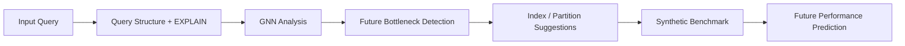
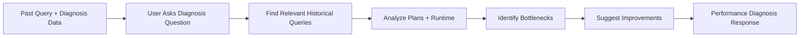
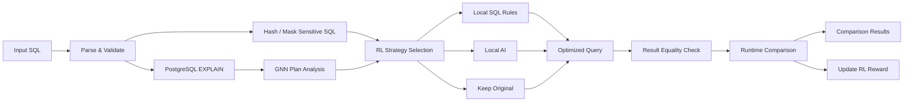
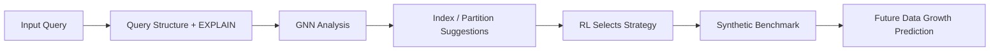
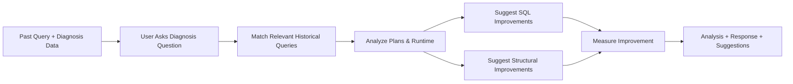
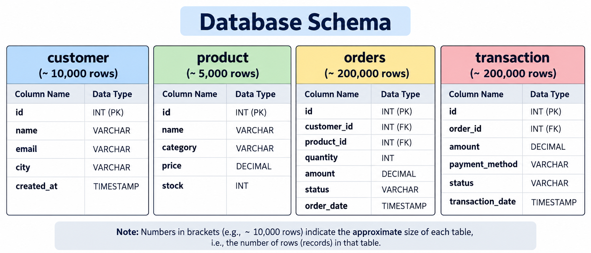

# QueryLab

**QueryLab is a local PostgreSQL query-optimization prototype that combines execution-plan analysis, GNN scoring, reinforcement learning, private AI-assisted rewriting, historical diagnosis, and future performance prediction.**

It is designed for safe experimentation: queries are analyzed locally, optimized candidates are verified against PostgreSQL, and structural recommendations are suggested rather than automatically applied.

---


## ⭐ Standout Features

QueryLab is not limited to optimizing only the query running right now. It also includes two additional analysis layers that make the project more complete:

### 🔮 Prediction Layer — Future Analysis

The **Prediction Layer** analyzes the current query structure and estimates how its performance may change as the database grows.

It can:

- analyze query structure using the GNN
- detect future bottlenecks
- simulate larger data sizes
- recommend indexes or partitioning
- estimate future runtime changes
- suggest preventive optimizations before performance becomes a problem



**Why it is special:**  
Instead of only fixing a slow query after the problem appears, QueryLab can suggest what may become slow in the future.

---

### 📊 Performance Layer — Past Analysis

The **Performance Layer** works on previously executed queries and diagnosis data.

A user can ask questions such as:

> Why was this report slow?

or

> Which joins caused the highest execution cost?

QueryLab then finds relevant historical queries, analyzes their plans and runtime, and provides focused improvement suggestions.

It can:

- analyze past query history
- diagnose previously slow queries
- answer performance-related questions
- identify expensive joins or operators
- suggest SQL improvements
- suggest structural improvements
- compare measured performance improvements



**Why it is special:**  
QueryLab does not only optimize the present query. It can also explain **what went wrong in the past** and help prevent similar performance issues.

---

### Past + Present + Future View

```text
PAST
Historical Queries
      ↓
Performance Layer
      ↓
Diagnosis & Improvements

PRESENT
Input SQL
      ↓
GNN + RL + AI
      ↓
Optimized Query

FUTURE
Current Query Structure
      ↓
Prediction Layer
      ↓
Future Bottlenecks & Recommendations
```

This gives QueryLab a **Past → Present → Future** optimization workflow:

- **Past:** diagnose previous performance problems
- **Present:** optimize the current SQL query
- **Future:** predict and prevent upcoming performance bottlenecks

---

## What QueryLab Does

- Accepts a PostgreSQL `SELECT` query.
- Masks table names, column names, and literal values before AI processing.
- Uses PostgreSQL `EXPLAIN` to obtain the execution plan.
- Uses a prototype **GNN** to analyze expensive plan operators.
- Uses **Reinforcement Learning** to choose an optimization strategy.
- Can use local **Ollama AI** to generate a rewrite when selected.
- Restores the original identifiers locally.
- Checks that the optimized query returns equivalent results.
- Benchmarks original and optimized queries.
- Supports analysis of past query history.
- Provides future-growth recommendations using a separate prediction layer.

---

# QueryLab Pipeline



### Main idea

The **GNN** understands the structure of the execution plan, while **RL** learns which optimization approach works better for similar query structures.

The final query is always checked against the original query before performance results are shown.

---

# Prediction Layer



### Future Analysis

The prediction layer estimates what may happen as the amount of data increases.

It can suggest:

- indexes
- partitioning
- structural improvements
- expected runtime changes

A separate synthetic PostgreSQL environment is used for experiments, so the original database structure is not modified.

---

# Performance Layer



### Past Analysis

Users can upload previous queries and ask questions such as:

> Why is the sales report slow? Check its joins.

QueryLab finds relevant queries, analyzes their plans, measures supported improvements, and returns focused recommendations.

---

## Demo Database

The project includes a synthetic retail database with **415,000 total records**.

| Table | Main Fields | Records |
|---|---|---:|
| `customer` | id, name, email, city, created_at | 10,000 |
| `product` | id, name, category, price, stock | 5,000 |
| `orders` | customer_id, product_id, quantity, amount, status, order_date | 200,000 |
| `transaction` | order_id, amount, payment_method, status, transaction_date | 200,000 |



---

## Tech Stack

| Component | Technology |
|---|---|
| Backend | Python, Flask |
| Database | PostgreSQL 17 |
| SQL parsing | SQLGlot |
| Database driver | Psycopg 3 |
| GNN | NumPy-based prototype GNN |
| RL | Contextual UCB Bandit |
| AI | Ollama |
| Default AI model | `qwen2.5-coder:0.5b` |
| Local RL / history state | SQLite |
| Frontend | HTML, CSS, JavaScript |
| Containers | Docker Compose |
| Testing | pytest |

---

## How Optimization Works

### 1. Parse and validate

Only supported read-only `SELECT` queries are accepted.

### 2. Privacy masking

Identifiers and literal values are replaced with temporary pseudonyms before AI processing.

Example:

```sql
SELECT name
FROM customer
WHERE city = 'Raipur';
```

may internally become something similar to:

```sql
SELECT c_1
FROM t_1
WHERE c_2 = :value_1;
```

The mapping stays local.

### 3. Execution-plan analysis

PostgreSQL generates an execution plan using `EXPLAIN`.

The plan is converted into a graph and analyzed by the GNN.

### 4. RL strategy selection

The RL agent chooses between available actions such as:

- keep the original query
- inline eligible CTEs
- remove duplicate `IN` values
- combine local rewrite rules
- use local AI

### 5. Validation and benchmarking

The optimized query is checked for equivalent results and then benchmarked against the original query.

The interface displays:

- original execution time
- optimized execution time
- planning time
- buffer statistics
- selected optimization strategy
- GNN plan graph

---

# Setup

## Requirements

- Python **3.11+**
- Docker Desktop
- Docker Compose
- Optional: Ollama for local AI

---

## Windows

```powershell
git clone https://github.com/PawanNITRR/Database-Query-Optimizzer.git
cd Database-Query-Optimizzer

python -m venv .venv

.\.venv\Scripts\python.exe -m pip install -r requirements.txt

docker compose up -d --build --wait

.\.venv\Scripts\python.exe app.py
```

Open:

```text
http://127.0.0.1:5000
```

---

## macOS / Linux

```bash
git clone https://github.com/PawanNITRR/Database-Query-Optimizzer.git
cd Database-Query-Optimizzer

python3 -m venv .venv

.venv/bin/python -m pip install -r requirements.txt

docker compose up -d --build --wait

.venv/bin/python app.py
```

---

## Enable Local AI

Install Ollama and download the model:

```bash
ollama pull qwen2.5-coder:0.5b
```

Then restart QueryLab.

AI is optional. QueryLab can still run using the GNN, RL, and local SQL rules.

---

# Using QueryLab

## Query Optimization

1. Enter a PostgreSQL `SELECT` query.
2. Enable or disable local AI.
3. Click **Optimize & Compare**.
4. View:
   - optimized SQL
   - GNN graph
   - runtime comparison
   - privacy information
   - RL decision

## Performance Analysis

1. Open **Ask about performance**.
2. Enter a diagnosis question.
3. Upload a `.sql` or `.json` query-history file.
4. QueryLab analyzes matching queries and suggests improvements.

## Prediction Layer

1. Enter a query.
2. Open **Prediction Layer**.
3. View index or partition suggestions.
4. Use the data-growth slider to inspect estimated future runtime.

---

## Supported SQL Optimizations

Current local rewrite rules include:

- removing duplicate values from `IN` lists
- replacing eligible `MATERIALIZED` CTEs with `NOT MATERIALIZED`
- AI-assisted rewriting when selected by RL

Not every query will be changed.

A slower optimized candidate is reported rather than hidden.

---

## Project Structure

```text
QueryLab/
├── app.py
├── database.py
├── privacy.py
├── optimizer.py
├── gnn.py
├── rl.py
├── recommendations.py
├── simulation.py
├── workload_upload.py
├── history.py
├── demo.sql
├── sandbox.sql
├── compose.yaml
├── templates/
├── static/
├── tests/
└── docs/
```

---

## Run Tests

```powershell
docker compose up -d --build --wait
.\.venv\Scripts\python.exe -m pytest -q
```

---

## Important Notes

QueryLab is a **hackathon / research prototype**, not a production database optimizer.

- It does not automatically modify the source database.
- GNN training uses synthetic execution-plan graphs.
- RL is a contextual bandit, not a full multi-step database tuning agent.
- Future runtime predictions are estimates based on synthetic benchmarking.
- Query performance can vary due to caching, hardware, and database load.
- Result verification and benchmarking can themselves be expensive.

---

## Summary

```text
                    ┌──── GNN ────┐
Input SQL → Masking ├──── RL ──────┤ → Optimized Query → Validation → Comparison
                    └──── AI ──────┘

Past Queries   → Performance Layer → Diagnosis & Improvements
Current Query  → Prediction Layer  → Future Growth Recommendations
```

**QueryLab combines current-query optimization, past-query diagnosis, and future-performance prediction in one local system.**
